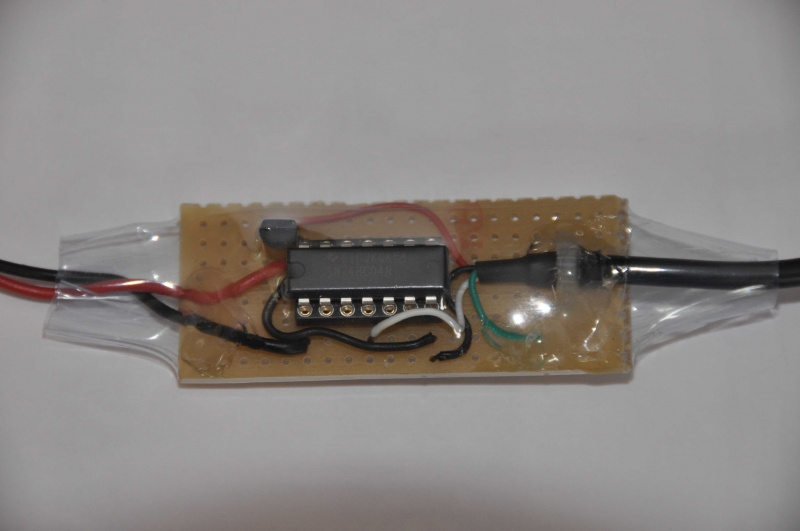
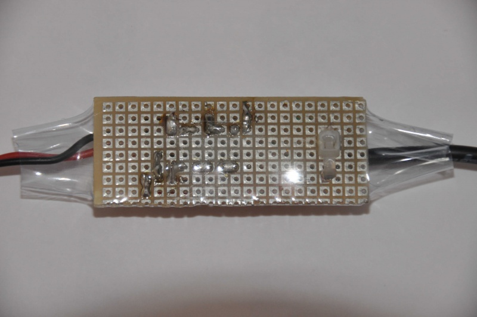
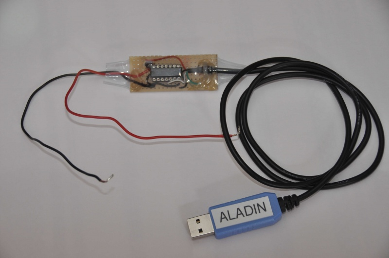
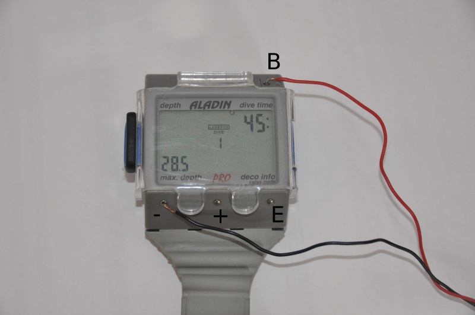

# Interface-USB-pour-Aladin-Pro
L'objectif de cette page est de décrire une méthode simple pour la réalisation d'une interface USB pour Aladin Pro. 

La solution repose sur l'utilisation d'un cable USB contenant un convertiseur USB/serie TTL avec alimentation 5V intégrée. On peut se le procurer un peu partout à des prix variant entre 8 et 30 €.

Attention : il existe différentes marques de chip USB/serial : Future Technology Devices Internationnal (FTDI), Prolific, Silicon labs etc.... Si vous voulez utiliser votre câble avec la version android de subsurface mobile (actuellement en version beta pour le download), il vous faut un câble avec un chip FTDI. Subsurface mobile pour android n'est pas compatible avec les autres chips.

J'ai utilisé un câble qui fournit une alimentation 5V et des signaux TTL de 3.3V. Il doit être possible d'utiliser des câbles différents, mais il faudrait adapter le schéma.

Si votre cable comporte des signaux supplémentaires ( RTS, CTS, jaune et bleu pour le mien), il suffit de ne pas les utiliser.

Il faut en plus un régulateur 3.3V 78L33 et un circuit 74HC04.

Le schéma du montage est le suivant : 

Pour la réalisation pratique, le schéma est suffisamment simple pour ne pas nécessiter de circuit imprimé. Il suffit d'utiliser une petite plaque de Veroboard à pastilles. Après quelques minutes de soudure et protection à l'aide film thermorétractable on obtient le résultat suivant: 

Pour l'utiliser il suffit de connecter la prise USB sur son PC favori, lancer son logiciel favori (exemple Subsurface, connecter le fil rouge sur le contact B, et le noir sur le - :

Les données sont envoyées au PC lors de l'affichage du log (appui sur E puis +) de la plongée 1 (la dernière).

Remarque 1 : le protocole de communication de l'Aladin est disponible sur internet, par exemple [ici](http://dive.hemnet.com.au/projects/gizmo/Aladin%20Info%202-1.htm)

Remarque 2 : Le logiciel opensource Subsurface permet de télécharger les plongées et de gérer un carnet.
